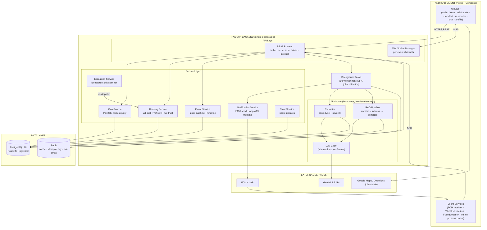
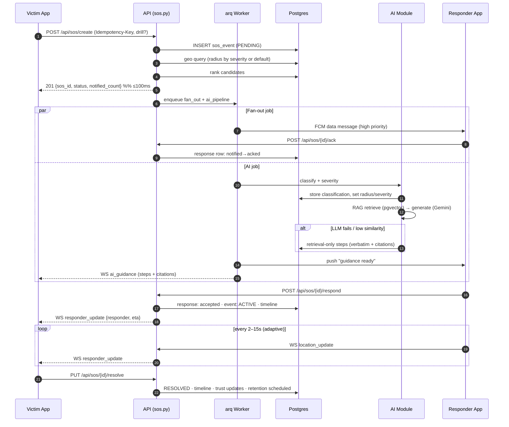
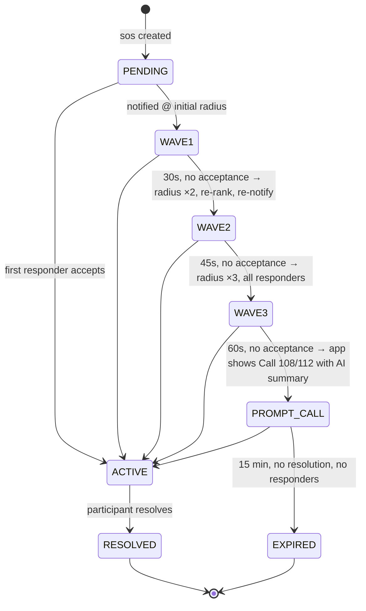
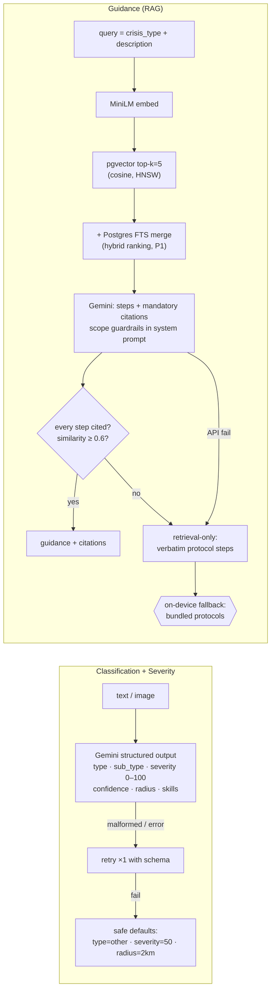
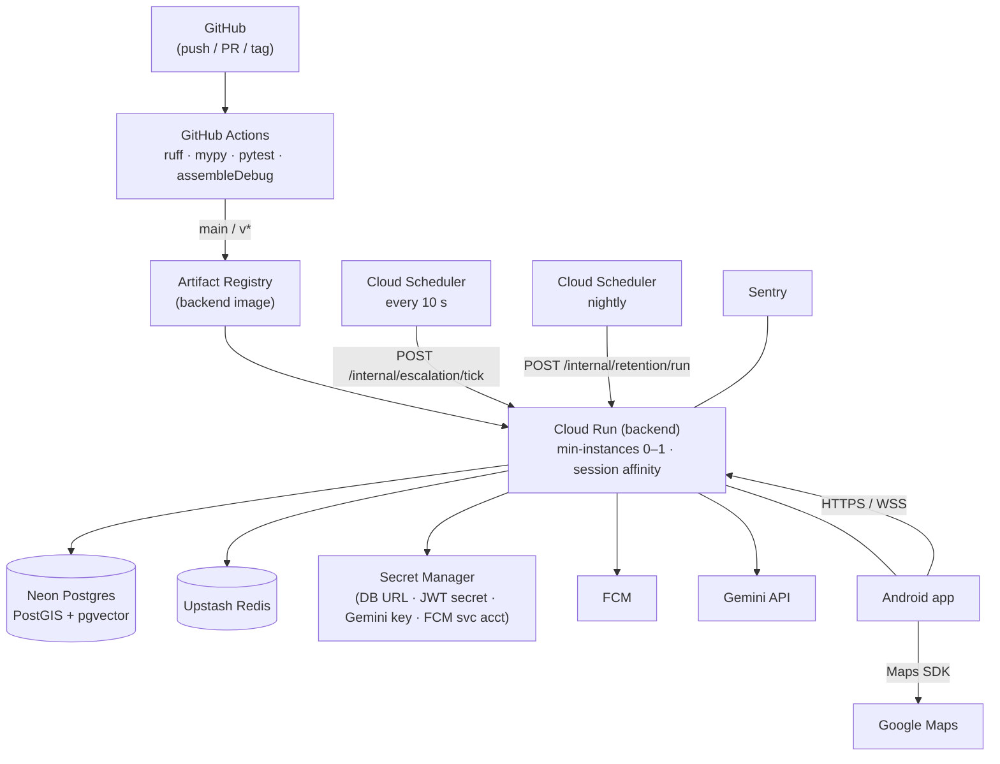

# NearHelp AI — System Architecture

> Detailed architecture for the implemented system. Aligns with `BLUEPRINT.md` (engineering decisions), `improvements.md` (hardening), and `DESIGN.md` (client UI). Where this differs from `proposal.md`, the proposal is the academic vision and this document is the implemented reality.

---

## Table of Contents

1. [Architectural Overview](#1-architectural-overview)
2. [Design Principles](#2-design-principles)
3. [Component Architecture](#3-component-architecture)
4. [The Critical Path — SOS Lifecycle](#4-the-critical-path--sos-lifecycle)
5. [Escalation Subsystem](#5-escalation-subsystem)
6. [AI Subsystem](#6-ai-subsystem)
7. [Real-Time Subsystem (WebSocket)](#7-real-time-subsystem-websocket)
8. [Notification Subsystem (FCM)](#8-notification-subsystem-fcm)
9. [Data Layer](#9-data-layer)
10. [Cross-Cutting Concerns](#10-cross-cutting-concerns)
11. [Failure Modes & Resilience](#11-failure-modes--resilience)
12. [Deployment Architecture](#12-deployment-architecture)
13. [Scalability Path](#13-scalability-path)
14. [Module Mapping (proposal → implementation)](#14-module-mapping-proposal--implementation)

---

## 1. Architectural Overview

NearHelp AI is a **three-tier system**: an Android client, a FastAPI backend that owns all coordination logic and data, and external services (FCM, Gemini, Google Maps) accessed server-side only.

The one architectural rule everything else serves:

> **The critical path (victim → alerted responders) must never wait on anything slow or unreliable — especially not AI.**

AI classification, severity scoring, and RAG guidance run *in parallel* with alert fan-out. Responders get the push notification in seconds; the AI-generated, cited guidance arrives moments later as a follow-up. If the AI path fails entirely, the system degrades to retrieval-only or offline cached protocols — alerting is never affected.



Key structural decisions (full rationale in `tech-stack.md` §ADR):

| Decision | Choice |
| --- | --- |
| AI service | **In-process module** behind an interface (`services/ai/`), not a separate microservice. Solo-dev deployability; the interface keeps the split extractable later. |
| Vector store | **pgvector** in the existing Postgres. One engine, one backup, one less failure mode. |
| Escalation | **Durable tick** (state-scanning endpoint + Cloud Scheduler), never in-memory timers. |
| Real-time | FastAPI WebSockets per SOS event; Redis pub/sub added only when scaling past one instance. |
| Background work | **arq** (Redis-based) worker for FCM fan-out, AI jobs, nightly retention. |

---

## 2. Design Principles

1. **Alerts before intelligence.** Critical path: validate → persist → geo query → rank → notify. Everything AI happens after or in parallel.
2. **State machines, not flags.** An SOS event moves through an explicit state machine (`PENDING → ACTIVE → RESOLVED | EXPIRED`); every transition writes a timeline event. All mutations are idempotent per transition.
3. **Degrade, never fail.** Every dependency (Gemini, FCM, Redis, WebSocket) has a defined fallback (§11). A safety system that 500s is worse than one that degrades loudly.
4. **One source of truth per concern.** Postgres owns all durable state (including vectors). Redis owns only ephemeral state (cache, idempotency, rate limits) — anything in Redis can be lost without correctness impact.
5. **Server-side intelligence, thin client.** The app never holds API keys, never runs ranking logic, never talks to Gemini. It renders state and streams location.
6. **Design for the demo, build for the defense.** DRILL mode, fake-GPS demo routes, and benchmark instrumentation are first-class features, not hacks.

---

## 3. Component Architecture

### 3.1 Android client

| Component | Responsibility |
| --- | --- |
| **UI layer** | Screens per `DESIGN.md`: Home (hold-for-SOS), Crisis Select (category grid + countdown), Incident Active (map + tabs), Responder (alert / en route / on scene), Auth, Profile. Compose + Material 3, single token theme. |
| **FCM receiver** | Receives high-priority **data** messages (SOS alert, guidance ready, escalation cue, resolution). Posts an app-level ACK to the backend (`POST /api/sos/{id}/ack`) so delivery is measured honestly. Routes deep-links to the right screen. |
| **WebSocket client** | Single connection per active event the user participates in. Sends `location_update`, `send_message`; receives `responder_update`, `new_message`, `timeline_event`, `ai_guidance`, `sos_resolved`. Auto-reconnect with backoff; falls back to REST polling after 3 failed attempts. |
| **Location service** | Foreground service during active participation only. FusedLocationProvider: 2–3s interval within 500 m of the victim, 10–15s beyond (adaptive). Never writes location otherwise (privacy rule). |
| **Offline protocol cache** | Top ~10 emergency protocols bundled as static assets. Rendered by the same GuidanceCard component as live RAG output. The AI-unavailable path ends here on-device. |
| **Readiness indicator** | Checks battery-optimization exemption, notification permission, location "Allow all the time" — surfaces a fix-it card on Home (Android OEM background-kill mitigation). |

### 3.2 Backend — API layer

| Router | Endpoints | Notes |
| --- | --- | --- |
| `auth.py` | register, login, refresh | bcrypt + JWT (15 min access / 7-day rotating refresh). |
| `users.py` | me, skills, fcm-token, location | Location write rejected unless user is an active participant. |
| `sos.py` | create, get, active, respond, resolve, timeline, guidance, ack | `create` and `respond` require `Idempotency-Key` headers. |
| `admin.py` | verifications queue/review, suspend, stats | Server-rendered minimal UI or CLI (no SPA in MVP). |
| `ws.py` | `/api/ws/{sos_id}` | Auth via one-time ticket (issued by REST) in the first frame — no long-lived token in the URL. |
| `internal.py` | `/internal/escalation/tick`, `/internal/retention/run` | Called by Cloud Scheduler; protected by a shared secret header. |

### 3.3 Backend — service layer

**Geo Service** — the only place PostGIS is queried. One query shape:

```sql
SELECT id, skills, trust_score,
       ST_Distance(location, :origin) AS distance_m
FROM users
WHERE is_active
  AND ST_DWithin(location, :origin, :radius_m)
ORDER BY distance_m
LIMIT 200;
```

GiST index on `users.location`. The service is trivially mockable — the Digital Twin simulator and the geo-benchmark experiment (RQ5-style) both call it directly.

**Ranking Service** — pure function over candidates:

```
score = 0.40 · (1 − distance/radius)      -- D: proximity
      + 0.35 · skillMatch × 1.2-if-verified  -- S: relevance
      + 0.25 · trust/100                   -- R: reliability
```

Top-N notified, N scaled by severity band (critical → all matched; low → top 3). Weights live in config, not code — the ablation study sweeps them without redeploys.

**Notification Service** — sends FCM data messages, records per-responder `notified → acked` state, handles `UNREGISTERED` token cleanup, and exposes the honest delivery metric (`acked / notified`) that escalation consumes.

**Escalation Service** — see §5.

**Event Service** — owns the SOS state machine; every transition appends a `timeline_events` row and (if participants are connected) broadcasts over WebSocket. Also computes stage timings (`geo_ms`, `rank_ms`, `fcm_ms`, `ai_ms`) written alongside the event — the deployed-system latency data for the defense charts.

**Trust Service** — applies the score deltas (+3 successful response, +2 positive feedback, −5 accept-no-show, −10 false event, …), clamps to [0, 100], and awards badges. Pure function + one UPDATE.

### 3.4 AI module (in-process)

Interface-first: `services/ai/` exposes `classify(text, image?) -> Classification`, `guidance(sos_id) -> Guidance` and an `LLMClient` abstraction over Gemini (swap-to-OpenAI-compatible-endpoint via env var — demo-day armor, not ideology). Internals in §6.

---

## 4. The Critical Path — SOS Lifecycle

Timing budget for `POST /api/sos/create` (P95 targets from the simulator):

| Stage | Budget | Notes |
| --- | --- | --- |
| Validate + idempotency check | 10 ms | Redis `SETNX` on Idempotency-Key. |
| Insert event (PENDING) | 20 ms | Single-row transaction. |
| Geo query | 30 ms | GiST-indexed, 1k–100k users (benchmarked). |
| Rank candidates | 5 ms | In-memory over ≤ 200 candidates. |
| **HTTP response to victim** | **≤ 100 ms** | Response returns here — the rest is background. |
| FCM fan-out (background) | 300 ms | arq job, parallel per-chunk sends. |
| AI classify + severity (background) | 1.5–3 s | Parallel to fan-out; results update the event and push a guidance-ready notification. |



**DRILL flag:** flows through the entire path — events tagged `is_drill`, notifications carry a "DRILL — NOT A REAL EMERGENCY" banner, escalation never arms the call-108/112 prompt, analytics exclude drill rows from real metrics.

---

## 5. Escalation Subsystem

In-memory timers die with serverless instances (cold starts, scale-to-zero, deploys). Escalation is therefore a **durable, idempotent scanner**:



- **Trigger:** Cloud Scheduler → `POST /internal/escalation/tick` every 10 s (shared-secret header). Locally: a worker loop.
- **Correctness:** the tick is a pure function of DB state (`WHERE status = 'PENDING' AND created_at < now() − interval AND last_escalation < wave`), so overlapping or missed ticks are harmless; each wave writes `escalation_wave` on the event before notifying (compare-and-set, single UPDATE ... RETURNING guards concurrent ticks).
- **Layer 2 (call 108/112)** is deliberately a *client-side prompt*, never an automated dial: the backend only pushes the "call now" cue with the AI-generated summary. Legally and technically the human stays in the loop.
- **Layer 3 (self-care)** lives on-device: the offline protocol cache (§3.1) covers no-network scenarios without any server involvement.

---

## 6. AI Subsystem

Three capabilities, one module, three reliability layers:



**Guardrails (enforced in code and in CI tests):**
- System prompt forbids dosages, diagnosis, prescriptions, invasive procedures; user text is interpolated as *data*, never as instructions (prompt-injection defense).
- Similarity < 0.6 or uncited steps → retrieval-only fallback, flagged in the payload.
- Blocklist regex post-filter strips prohibited terms from any generation that slips through.
- Every AI output is persisted with `prompt_version`, retrieved chunk IDs, and latency — the audit trail and the eval-harness data source.

**Prompt/versioning:** prompts are versioned files; `(prompt_version, output, refs)` logged per call; the golden-set eval (`python -m ai.eval`, 50–100 scenarios) must pass classification ≥ 85 % and retrieval precision@5 ≥ 80 % before any prompt/corpus change merges.

---

## 7. Real-Time Subsystem (WebSocket)

- **Channel = SOS event.** `ConnectionManager` maps `sos_id → {victim conn, responder conns}`. Joining requires the one-time ticket (proves participation without putting JWTs in URLs).
- **Fan-out within a channel** is in-process dict iteration (single instance). **Multi-instance** (only when needed): publish to Redis pub/sub per `sos_id`; each instance relays to its local connections. The `ConnectionManager` interface hides this change from callers.
- **Location relay** is store-and-forward with rate limiting (≤ 1 msg / 2 s per connection); the map animates between points client-side, so 2–15 s updates look continuous.
- **Degradation:** after 3 reconnect failures the client silently switches to `GET /api/sos/{id}` polling every 5 s. Chat and timeline remain functional (REST), only marker smoothness degrades.
- Cloud Run specifics: session affinity enabled; graceful shutdown drains connections on deploy (30 s).

---

## 8. Notification Subsystem (FCM)

- **Data messages, high priority** (not notification messages) — the app controls rendering (full-screen SOS activity, DRILL banners, channel-specific sounds).
- **App-level ACK** is the delivery signal: FCM provides no reliable per-device receipts for display messages; honesty beats pretending. `acked/notified` per wave feeds escalation decisions and the defense metrics.
- **Token hygiene:** tokens stored per device; FCM `UNREGISTERED` → row deleted (otherwise "notified 12 responders" quietly becomes fiction).
- **Retry:** 3 attempts, exponential backoff per token-chunk; permanent failures mark the response row `undelivered` and escalation treats it as "not reached".

---

## 9. Data Layer

**PostgreSQL 16 + PostGIS + pgvector — three roles, one engine:**

| Role | Objects |
| --- | --- |
| Operational | `users`, `sos_events`, `responses`, `messages`, `timeline_events`, `skill_verifications`, `ai_outputs` |
| Geospatial | `GEOGRAPHY(Point)` columns + GiST indexes (users.location, sos_events.location) |
| Vector | `kb_chunks(embedding vector(384))` + HNSW cosine index (the RAG corpus) |

Schema, indexes, and the ER diagram live in `BLUEPRINT.md` §3 and remain authoritative.

**Redis — ephemeral only:**
- Idempotency keys (`SETNX`, TTL 24 h) for `sos/create`, `sos/respond`.
- Rate limits (100 req/min/user; 10 SOS/day/user) — token bucket per key.
- Refresh-token revocation list; WebSocket pub/sub (only when multi-instance).
- Optional LLM-response cache keyed on normalized text (P2).

**Data lifecycle (privacy by design):**
- `users.location` written only during active participation; nulled on resolution/expiry.
- Resolved events: precise location replaced by a rounded (≈ 250 m) anonymized point for analytics.
- Messages pruned 30 days after resolution; drill events excluded from analytics aggregates.
- Enforced by the nightly retention job (`/internal/retention/run`), not by good intentions.

---

## 10. Cross-Cutting Concerns

| Concern | Design |
| --- | --- |
| **AuthN/AuthZ** | JWT bearer; roles `user < verified_responder < admin`; SOS visibility limited to participants + admin; location writes restricted to active participants. |
| **Idempotency** | Client-generated `Idempotency-Key` on all critical-path mutations; Redis-guarded, response cached 24 h. Retries from flaky mobile networks can never create duplicate emergencies. |
| **Observability** | Structured JSON logs with `sos_id` correlation on every request in the SOS path; Sentry (backend + Android); per-stage timing columns feeding the defense charts; `/health` for Cloud Run probes. |
| **Configuration** | Pydantic Settings; one `.env.example` listing every variable; secrets never in git (Secret Manager in prod). |
| **Time** | All timestamps UTC in the DB; client renders local. Escalation math is server-side only. |
| **Testing seams** | Ranking is pure; Geo/Notification/AI/LLM are interfaces — unit tests never touch FCM or Gemini; integration tests run against real Postgres (docker-compose) because geo queries and pgvector must be tested for real. |

---

## 11. Failure Modes & Resilience

| Dependency fails | System behavior | User experience |
| --- | --- | --- |
| Gemini API (down / quota) | Retry ×1 → retrieval-only guidance → client falls back to bundled protocols | Guidance still arrives, flagged "offline protocol" |
| pgvector returns low-similarity chunks | Refuse to generate; verbatim top chunk or "wait for professional help" + call-services cue | No hallucinated advice — by design |
| FCM undelivered for a responder | Marked `undelivered`; escalation wave treats as not-reached; next wave re-notifies others | Victim sees radius-expansion cues |
| WebSocket drops | Client auto-reconnects ×3 → REST polling | Slightly steppy map; chat/timeline fine |
| Redis down | Rate limiting and idempotency degrade-open (Postgres unique index on `idempotency_key` is the backstop) | SOS creation still works; duplicate risk only during retry storms |
| Cloud Run instance recycled mid-event | No in-memory state exists; escalation is tick-driven; WS clients reconnect | 2–5 s blip |
| Gemini returns malformed JSON | Schema-retry → safe defaults (type=other, severity 50, 2 km) | Alerts still sent with conservative radius |
| Client offline entirely | On-device protocol cache + native dialer | Self-care guidance + 108/112 calling still possible |

**Invariant tested in CI:** for every failure injection above, `sos/create` still returns ≤ 100 ms and fan-out still occurs. The critical path has no optional dependencies.

---

## 12. Deployment Architecture



- **Single Cloud Run service** holds API + WebSocket + tick endpoints; the arq worker runs as a second Cloud Run service (same image, different entrypoint) so background load never affects request latency.
- **Migrations** run as a pre-deploy Cloud Build step (Alembic upgrade head) before new containers receive traffic.
- **Local dev = same topology:** docker-compose (postgres+postgis+pgvector, redis, backend, worker) plus a local tick loop. The demo can run entirely from a laptop if the venue network fails.
- **Environments:** one staging-grade deployment doubles as demo; no production user data exists in a college project — DRILL mode is the moral equivalent.

---

## 13. Scalability Path

The MVP targets one region, ~hundreds of users, and 100 concurrent SOS events in simulation. The architecture's escape hatches, in the order they'd be needed:

1. **WebSocket fan-out** → Redis pub/sub per event channel (interface already isolates `ConnectionManager`).
2. **Geo query volume** → `users` partitioning by region + read replicas; queries are already index-shaped.
3. **AI throughput** → extract the AI module to its own service (it was interface-isolated for exactly this) and scale independently.
4. **FCM volume** → chunked batch sends (already batched) and a dedicated notification worker.
5. **Retention/analytics growth** → move analytics reads to a replica; nightly aggregates instead of live scans.

None of these are built in the MVP; all of them are one-config-or-one-file changes. That is the whole point of the interface boundaries in §3.

---

## 14. Module Mapping (proposal → implementation)

| Proposal module | Implementation | Notes |
| --- | --- | --- |
| 1 Auth | JWT email/password | Firebase OAuth/OTP deferred to V1 |
| 2 Profile | users API + profile screen | Medical fields not collected (data minimization) |
| 3 Skill verification | skill_verifications + minimal admin | |
| 4 AI detection | AI module classify | |
| 5 Severity | AI module classify (one Gemini call) | Merged with 4 — one structured output |
| 6 Smart SOS engine | Geo + Ranking + Escalation services | Durable tick design |
| 7 Live Map / 8 Tracking | One incident map screen | Merged |
| 9 AI Navigation | Google Directions deep-link | Simplified |
| 10 Crisis Assistant | Single RAG chain + clarifying prompt | LangGraph agent deferred to V1 |
| 11 RAG KB | pgvector + MiniLM + WHO/Red Cross corpus | |
| 14 Timeline | timeline_events + WS broadcast | |
| 16 Reputation | Trust service | |
| 18 Admin | Minimal (server-rendered/CLI) | React dashboard V1 |
| 23 Digital Twin | simulator/ (built ~week 6) | Research instrument, not month-4 slide factory |
| 12, 13, 15, 17, 19–22, 24 | Future scope | See `BLUEPRINT.md` §7 |
