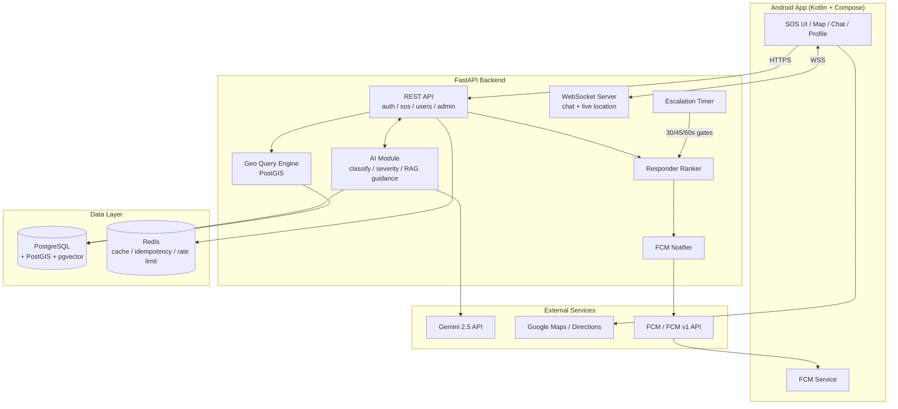
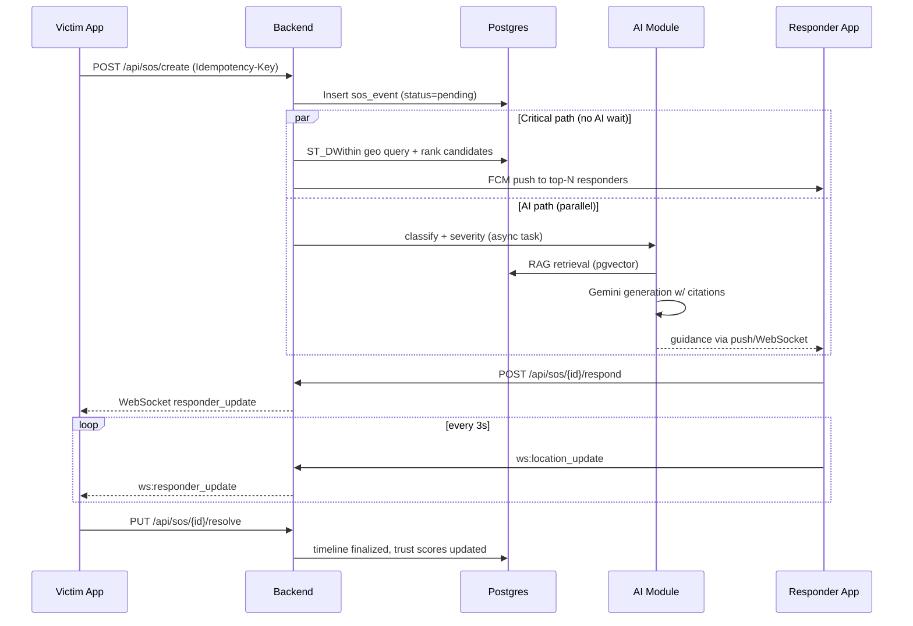
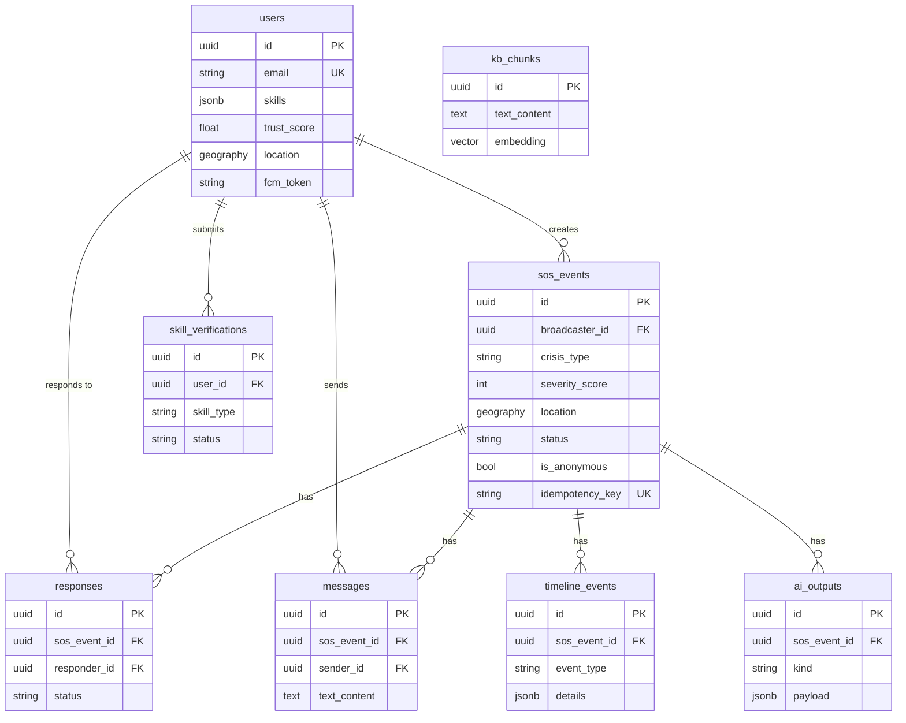

# NearHelp AI — Technical Blueprint

> Implementation-ready companion to `proposal.md`. Where the two disagree, this document wins for engineering decisions; the proposal remains the academic source of truth.

---

## 0. De-Scoping Decisions (challenges to the proposal)

The proposal specifies 24 modules for one developer in 4 months. Even MoSCoW Phase 1 (11 modules) is heavy. This blueprint tightens it further:

| # | Proposal says | Blueprint decides | Why |
| --- | --- | --- | --- |
| D1 | AI as a separately deployed microservice (§9.1) | AI is a **module inside the backend**, behind a clean interface (`services/ai/`) | One deploy, one log stream, one debug loop for a solo dev. The interface boundary keeps the proposal's decoupling benefit; splitting into a real service is a config change later, not a rewrite. |
| D2 | ChromaDB vector store | **pgvector** on the existing Postgres | Postgres is already in the stack. One fewer component to run, back up, and learn. Corpus (~500–2000 chunks) is tiny. ChromaDB is acceptable if pgvector setup blocks you. |
| D3 | Firebase Auth (OAuth/OTP) + custom JWT | **Email/password + JWT in FastAPI** for MVP; Google Sign-In and phone OTP in V1 | Firebase Auth *plus* custom JWT is double bookkeeping. One auth path, fully under your control, easier to demo and test. |
| D4 | LangGraph multi-node agent (Module 10) | **Single well-prompted RAG chain** for MVP | A structured prompt with retrieval + clarifying-question support covers the MVP use cases. The graph agent is V1. |
| D5 | Live Map (7) + Live Tracking (8) + AI Navigation (9) | **One map screen** with live markers; navigation = Google Directions deep-link | Three modules collapse into one screen and an intent. AI-routed navigation is Future. |
| D6 | Encrypted medical fields (AES-256 at rest) | **Don't collect medical data in MVP** | Data minimization beats encryption you won't have time to key-manage correctly. Encrypted fields return in V1 with real medical data needs. |
| D7 | React/Next.js admin dashboard (Module 18) | **Minimal admin: FastAPI-served simple HTML pages + CLI scripts** for MVP | Skill verification queue and user suspension don't need a SPA. React dashboard is V1. |
| D8 | Anonymous mode, SMS fallback, Disaster/Guardian modes | **Future** | None are needed to prove the research question. |

**Assumptions (not requirements) — validate early, cheap to be wrong about:**

- Gemini free tier is sufficient for dev + demo load.
- Single-region, single-instance deployment is acceptable.
- FCM is reachable from demo devices (Google Play Services present).
- Google Maps API free tier covers demo usage.
- Demo area is Kolkata (proposal's example geography).

---

## 1. Architecture

Three tiers. The critical invariant: **alerting responders never waits on AI**. SOS creation fans out FCM pushes immediately; classification/severity/guidance run in parallel and arrive as a follow-up push or WebSocket message.



### SOS lifecycle data flow



**Escalation (backend timers):** no acceptance at 30s → radius ×2 re-notify; 45s → radius ×3; 60s → surface "call 108/112" action with AI summary in the victim app. Auto-dial is a client-side intent; the backend only prompts it.

---

## 2. Tech Stack

| Layer | Primary | Why | Alternative (only if needed) |
| --- | --- | --- | --- |
| Mobile | Kotlin + Jetpack Compose | Declarative UI, coroutines for WebSocket/location streams | — |
| Maps/Push | Google Maps SDK + FCM | Best maps for India; FCM reaches backgrounded Androids (WebSockets can't) | — |
| Backend | FastAPI (Python) | Async-first, Pydantic validation, built-in WebSocket, auto OpenAPI | — |
| Database | PostgreSQL 16 + PostGIS + **pgvector** | ACID for SOS events, best-in-class geo indexing, and now the vector store — one engine | MongoDB (rejected: consistency model) |
| ORM | SQLAlchemy 2.0 + GeoAlchemy2 | Async, PostGIS native | — |
| Cache | Redis 7 | Idempotency keys, rate limiting, pub/sub | — |
| LLM | Gemini 2.5 (structured output) | Multilingual (critical for India), vision, generous free tier | — |
| Embeddings | `all-MiniLM-L6-v2` (384-dim) | Small, fast, runs in-process, sufficient for ~2k chunks | Gemini embeddings |
| Auth | FastAPI-issued JWTs (email/password, bcrypt) | One mechanism, fully testable (D3) | Firebase Auth in V1 for OAuth/OTP |
| Hosting | Google Cloud Run | Serverless containers, pay-per-use, free friendly | Railway/Render |
| CI/CD | GitHub Actions | Free for public repos | — |
| Monitoring | Sentry (errors) + Cloud Run logs | Minimum viable observability | Prometheus/Grafana in V1 |

---

## 3. Database

### Entities

| Entity | Purpose | Key fields |
| --- | --- | --- |
| `users` | Identity, skills, trust | `id`, `email` (unique), `name`, `phone`, `languages[]`, `skills` (JSONB: `{type, verified, certificate_url}`), `trust_score` (default 50), `location GEOGRAPHY(Point)` (NULL unless active), `fcm_token`, `is_active`, timestamps |
| `sos_events` | One emergency | `id`, `broadcaster_id FK`, `crisis_type`, `sub_type`, `severity_score`, `location GEOGRAPHY(Point)`, `description`, `status` (`pending/active/resolved/expired`), `is_anonymous`, `radius_m`, `idempotency_key` (unique), timestamps |
| `responses` | Responder participation | `id`, `sos_event_id FK`, `responder_id FK`, `status` (`notified/accepted/arrived/completed`), `eta_seconds`, timestamps — unique `(sos_event_id, responder_id)` |
| `messages` | Event chat | `id`, `sos_event_id FK`, `sender_id FK`, `text`, `language`, `created_at` |
| `timeline_events` | Audit trail | `id`, `sos_event_id FK`, `event_type`, `actor_id FK nullable`, `details JSONB`, `created_at` |
| `skill_verifications` | Verification queue | `id`, `user_id FK`, `skill_type`, `certificate_url`, `status`, `reviewed_by FK nullable`, timestamps |
| `ai_outputs` | Cached AI results + citations | `id`, `sos_event_id FK`, `kind` (`classification/severity/guidance/summary`), `payload JSONB`, `retrieved_refs JSONB`, `latency_ms`, `created_at` |
| `kb_chunks` | RAG corpus | `id`, `source`, `procedure_name`, `crisis_type`, `step_number`, `text`, `embedding vector(384)` |

### Indexes

```sql
CREATE INDEX idx_users_location ON users USING GIST (location);
CREATE INDEX idx_sos_status_created ON sos_events (status, created_at);
CREATE INDEX idx_sos_location ON sos_events USING GIST (location);
CREATE INDEX idx_responses_event ON responses (sos_event_id);
CREATE INDEX idx_timeline_event ON timeline_events (sos_event_id, created_at);
CREATE INDEX idx_kb_embedding ON kb_chunks USING hnsw (embedding vector_cosine_ops);
CREATE UNIQUE INDEX idx_sos_idem ON sos_events (idempotency_key);
```

### ER diagram



**Privacy rules (MVP):** `users.location` written only during active participation, nulled after resolution; `sos_events` location anonymized after resolution for analytics; messages retained 30 days post-resolution.

---

## 4. API

Auth column: **JWT** = Bearer token required, **Admin** = JWT with admin role, **None** = public.

### REST

| Method & Path | Purpose | Auth | Request → Response (abridged) |
| --- | --- | --- | --- |
| `POST /api/auth/register` | Create account | None | `{email, password, name, phone}` → `{user_id, access_token, refresh_token}` |
| `POST /api/auth/login` | Login | None | `{email, password}` → `{access_token (15 min), refresh_token (7 d)}` |
| `POST /api/auth/refresh` | Rotate tokens | None | `{refresh_token}` → new token pair |
| `GET /api/users/me` | Profile | JWT | → `{id, name, email, skills[], trust_score, languages[]}` |
| `PUT /api/users/me` | Update profile | JWT | `{name?, languages?, phone?}` → updated user |
| `POST /api/users/me/skills` | Claim skill + upload proof | JWT | multipart `{skill_type, certificate}` → `{verification_id, status: "pending"}` |
| `POST /api/users/me/fcm-token` | Register push token | JWT | `{fcm_token}` → `204` |
| `PUT /api/users/me/location` | Update live location | JWT (active SOS only) | `{lat, lon}` → `204` |
| `POST /api/sos/create` | Create SOS (**Idempotency-Key header required**) | JWT | `{description, lat, lon, crisis_type?}` → `{sos_id, status, notified_count}` |
| `GET /api/sos/{id}` | Event details | JWT (participant) | → `{crisis_type, severity_score, status, responders[], location?}` |
| `GET /api/sos/active` | My active events | JWT | → `[sos_event]` |
| `POST /api/sos/{id}/respond` | Accept (idempotent) | JWT | `{}` → `{response_id, status: "accepted"}` |
| `PUT /api/sos/{id}/resolve` | Resolve event | JWT (participant) | `{outcome?}` → `{sos_id, resolved_at}` |
| `GET /api/sos/{id}/timeline` | Audit trail | JWT (participant) | → `[{event_type, actor, details, created_at}]` |
| `GET /api/sos/{id}/guidance` | RAG guidance (poll if async) | JWT (participant) | → `{steps[], citations[], confidence}` |
| `POST /api/ai/classify` | Classify emergency | JWT | `{text \| image_b64}` → `{crisis_type, sub_type, confidence, severity, recommended_radius_km}` |
| `GET /api/admin/verifications` | Verification queue | Admin | → `[{id, user, skill_type, certificate_url}]` |
| `PUT /api/admin/verifications/{id}` | Approve/reject | Admin | `{decision, reason?}` → `204`; approve sets skill verified, trust +5 |
| `PUT /api/admin/users/{id}/suspend` | Suspend user | Admin | `{reason}` → `204` |

### WebSocket — `WSS /api/ws/{sos_id}` (JWT in query or first message)

| Direction | Event | Payload |
| --- | --- | --- |
| C→S | `location_update` | `{lat, lon, ts}` |
| C→S | `send_message` | `{text, language}` |
| S→C | `responder_update` | `{responder_id, lat, lon, eta}` |
| S→C | `new_message` | `{sender, text, translated_text?, ts}` |
| S→C | `timeline_event` | `{event_type, actor, details, ts}` |
| S→C | `ai_guidance` | `{steps[], citations[]}` |
| S→C | `sos_resolved` | `{resolved_by, ts}` |

---

## 5. Repository Structure

```
NearHelp/
├── android/                     # Kotlin + Compose app
│   └── app/src/main/java/com/nearhelp/
│       ├── data/                # Retrofit API, WebSocket client, repositories
│       ├── domain/              # Models, use cases
│       ├── ui/                  # screens: auth, sos, map, chat, profile
│       └── di/                  # Hilt modules
├── backend/
│   ├── app/
│   │   ├── api/                 # auth.py, users.py, sos.py, admin.py, ws.py
│   │   ├── core/                # config, security (JWT), rate limiting
│   │   ├── models/              # SQLAlchemy models
│   │   ├── schemas/             # Pydantic schemas
│   │   ├── services/
│   │   │   ├── geo_service.py
│   │   │   ├── ranking_service.py
│   │   │   ├── notification_service.py
│   │   │   ├── escalation_service.py
│   │   │   └── ai/              # AI module (interface: ai_client.py)
│   │   │       ├── classify.py
│   │   │       ├── rag.py       # embed, retrieve, generate
│   │   │       └── prompts.py
│   │   └── main.py
│   ├── scripts/                 # seed_test_users.py, ingest_kb.py, admin CLI
│   ├── tests/
│   ├── requirements.txt
│   └── Dockerfile
├── knowledge_base/              # raw protocol PDFs/HTML + chunking config
├── simulator/                   # Digital Twin: locustfile.py, scenarios/
├── docker-compose.yml           # postgres+postgis+pgvector, redis, backend
├── .github/workflows/ci.yml
├── docs/                        # BLUEPRINT.md, API.md, diagrams/
└── README.md
```

(Note: no separate `ai_service/` or `admin_dashboard/` top-level dirs — decision D1/D7.)

---

## 6. Security & Deployment

**AuthN/AuthZ**
- bcrypt (cost 12) passwords; JWT access (15 min) + refresh (7 days, rotation, revocation list in Redis).
- Roles: `user` < `verified_responder` < `admin`. SOS visibility limited to participants (victim, accepted responders, admin).
- Rate limits (Redis): 100 req/min per user; 10 SOS/day per user.

**Secrets**
- Never in git. Local: `.env` (gitignored). Cloud Run: env vars from Secret Manager. One `SECRETS.md` doc listing every secret and where it lives.

**API security**
- TLS everywhere (Cloud Run default). Pydantic strict validation. Idempotency keys on `sos/create` and `respond`. CORS locked to nothing (app is not a browser client) except admin pages.

**AI security & safety**
- RAG guardrails: system prompt forbids dosages/diagnosis/prescriptions; retrieval similarity < 0.6 → fallback "call emergency services"; every instruction must cite a source, uncited instructions stripped; all AI outputs logged with citations for audit.
- Prompt-injection: user text is never interpolated as instructions — only as data fields in a fixed template; image/audio treated the same.
- Gemini API key server-side only; the app never talks to Gemini directly.
- Non-dismissible disclaimer on every guidance screen (proposal §13.4).

**Hosting**
- Backend: Cloud Run (one service, min-instances 0 for cost, or 1 during demo).
- DB: managed Postgres with PostGIS + pgvector (Cloud SQL or Neon — Neon's free tier is generous and supports both extensions).
- Redis: Upstash free tier (idempotency/rate limit) — optional for single-instance MVP, required before scaling out.
- Storage of certificates: Cloud Storage bucket, signed URLs, private by default.

**CI/CD (GitHub Actions)**
- On PR: ruff + mypy + pytest (backend), Android assembleDebug.
- On main: build Docker image → push to Artifact Registry → deploy Cloud Run (staging; production tag on `v*` tags).
- Alembic migrations run as a release step before the new container serves traffic.

**Monitoring**
- Sentry (backend + Android) — free tier.
- Cloud Run request logs + a `/health` and `/metrics-light` endpoint.
- Structured JSON logs with `sos_id` correlation ID on every request in the SOS path.

---

## 7. MVP vs Future

**MVP (proves the research question; ~10–11 weeks)**

1. Auth: email/password, JWT
2. User profile: basic fields, skill claims + certificate upload
3. SOS creation with idempotency, PostGIS radius query, responder ranking
4. FCM push to ranked responders + 30/45/60s radius escalation
5. AI classification + severity (Gemini, structured output, runs parallel to alerts)
6. RAG first-aid guidance with citations (pgvector + MiniLM + WHO/Red Cross corpus)
7. Responder accept flow + WebSocket live location + basic chat
8. One map screen: victim + responder markers, Google Directions deep-link
9. Timeline logging + resolution + trust score updates
10. Minimal admin: verification queue (server-rendered page or CLI)
11. Digital Twin simulator + defense charts (this is the academic deliverable — do not cut)

**Production/V1**

- Google Sign-In / phone OTP (Firebase Auth migration if needed)
- React admin dashboard with analytics/heatmaps
- AI incident reports, reputation badges, AI translation, voice SOS
- Multi-instance WebSocket fan-out (Redis pub/sub), Prometheus/Grafana
- Skill-verified ranking bonus weighting, fraud flagging
- Encrypted medical fields with consent-based sharing

**Future**

- Anonymous mode, SMS/offline fallback, Guardian mode, Disaster mode
- LangGraph multi-turn crisis agent, WebRTC voice/video
- iOS, wearables, government 112/108 API integration, predictive hotspot analytics

---

## 8. Master TODO

## Phase 1 — Setup
- [ ] Init monorepo, .gitignore, README, `.env.example` (P0)
- [ ] docker-compose: postgres+postgis+pgvector, redis, backend skeleton (P0)
- [ ] Alembic migrations for all MVP tables + indexes (P0)
- [ ] Android project: Compose, navigation, Hilt, Retrofit skeleton (P0)
- [ ] Firebase project + FCM setup, test push to emulator (P0)
- [ ] CI: lint + test workflow on PRs (P1)
- [ ] GCP project, Cloud Run + Secret Manager skeleton (P1)

## Phase 2 — Backend
- [ ] Auth: register/login/refresh, bcrypt, JWT deps (P0)
- [ ] Users API: profile, skills, fcm-token (P0)
- [ ] SOS create with idempotency + PostGIS geo query + ranking service (P0)
- [ ] FCM notifier + escalation timers (30/45/60s) (P0)
- [ ] Respond + resolve endpoints, trust score updates (P0)
- [ ] WebSocket channel: location stream, chat, timeline broadcast (P0)
- [ ] Timeline events on every state change (P1)
- [ ] Rate limiting (P1)
- [ ] Admin: verification queue endpoints + minimal UI (P1)
- [ ] Seed script: 1k test users with geo + skills (P1)

## Phase 3 — Frontend (Android)
- [ ] Login/register screens, token storage, auto-refresh (P0)
- [ ] SOS trigger screen (description + location + confirm) (P0)
- [ ] FCM receiver → SOS alert screen → respond action (P0)
- [ ] Map screen: victim + live responder markers (P0)
- [ ] Chat screen over WebSocket (P1)
- [ ] Profile + skill upload (P1)
- [ ] Disclaimer banner on all guidance UI (P0)
- [ ] Resolve flow + feedback prompt (P1)

## Phase 4 — AI
- [ ] Ingest WHO/Red Cross corpus → procedure-level chunks (P0)
- [ ] Embed + index in pgvector; retrieval evaluation set (P0)
- [ ] Classification + severity prompts with structured JSON output (P0)
- [ ] RAG generation prompt: citations mandatory, < 0.6 similarity fallback, scope guardrails (P0)
- [ ] Wire into SOS path as parallel async task; deliver guidance via WS/push (P0)
- [ ] AI latency logging (defense chart data) (P1)
- [ ] Post-generation citation verification filter (P1)

## Phase 5 — Testing & Deployment
- [ ] pytest unit tests: ranking, geo, idempotency (P0)
- [ ] Integration tests: SOS lifecycle API flow (P0)
- [ ] Digital Twin simulator + Locust scenarios (P1 — academic deliverable)
- [ ] Defense charts: RQ1–RQ5 auto-generated PNGs (P1)
- [ ] CI/CD deploy to Cloud Run + migrations (P1)
- [ ] Sentry integration backend + Android (P1)
- [ ] Two-device end-to-end demo rehearsal (P0)
- [ ] Docs: API.md, setup guide, demo script (P1)

---

## 9. Build Order

**First 10 tasks (in order):**

1. Monorepo + docker-compose (Postgres/PostGIS/pgvector + Redis + FastAPI skeleton) with `/health`
2. Alembic migrations: users, sos_events, responses (+ indexes)
3. Auth endpoints + JWT middleware
4. Seed script: 1,000 fake users with locations and skills
5. `POST /api/sos/create` with idempotency + PostGIS radius query (verify against seed data)
6. Responder ranking service + unit tests
7. Firebase/FCM integration — SOS on device A pushes to device B (end-to-end proof)
8. Android skeleton: login + SOS button wired to the API
9. Ingest CPR/first-aid corpus → pgvector; `GET /api/sos/{id}/guidance` RAG endpoint
10. Wire AI into SOS path as parallel task; guidance delivered via push to responder

**First working milestone (proposal Month-1 exit):**
Two physical Android devices: Device A triggers SOS → Device B receives FCM push within seconds → B opens the event and sees AI-generated, cited CPR guidance. This single demo de-risks the two hardest parts (real-time delivery + grounded AI) and is the kernel everything else hangs on.

**Production-ready milestone:**
Full lifecycle on devices — SOS → ranked notifications → acceptance → live map tracking → chat → resolution → timeline → trust score update — deployed on Cloud Run with CI/CD, Sentry, and Digital Twin benchmark charts generated from the deployed system.
